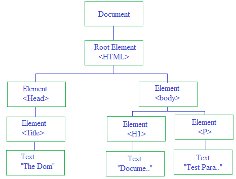

# DOM

## The HTML DOM (Document Object Model)

- When a web page is loaded, the browser creates a Document Object Model of the page.
- The HTML DOM model is constructed as a tree of Objects:

```
<!DOCTYPE html>
<html>
	<head>
		<title>The DOM</title>
	</head>
	<body>
		<h1>Document Object Model</h1>
		<p id="pr">Test Paragraph</p>
	</body>
</html>
```



### With the object model, JavaScript gets all the power it needs to create dynamic HTML:

- JavaScript can change all the HTML elements in the page
- JavaScript can change all the HTML attributes in the page
- JavaScript can change all the CSS styles in the page
- JavaScript can remove existing HTML elements and attributes
- JavaScript can add new HTML elements and attributes
- JavaScript can react to all existing HTML events in the page
- JavaScript can create new HTML events in the page

## What is the HTML DOM?

- The HTML DOM is a standard object model and programming interface for HTML. It defines:
- The HTML elements as objects
- The properties of all HTML elements
- The methods to access all HTML elements
- The events for all HTML elements
- The HTML DOM is a standard for how to get, change, add, or delete HTML elements.

### The following example changes the content (the innerHTML) of the <p> element with id="demo":

```


<html>
<body>

<p id="demo"></p>

<script>
document.getElementById("demo").innerHTML = "Hello World!";
</script>

</body>
</html>


```

### In the example above, getElementById is a method, while innerHTML is a property.

## The HTML DOM Document Object

- The document object represents your web page.

- If you want to access any element in an HTML page, you always start with accessing the document object.

### Finding HTML Elements

```
document.getElementById(id)	- Find an element by element id
document.getElementsByTagName(name)	- Find elements by tag name
document.getElementsByClassName() - Find elements by class name
document.getElementsByClassName(name)- 	Find elements by class name
```

### Changing HTML Elements

```
element.innerHTML =  new html content	Change the inner HTML of an element
element.attribute = new value	Change the attribute value of an HTML element
element.style.property = new style	Change the style of an HTML element

```

### Adding and Deleting Elements

```
document.createElement(element)	Create an HTML element
document.removeChild(element)	Remove an HTML element
document.appendChild(element)	Add an HTML element
document.replaceChild(new, old)	Replace an HTML element
document.write(text)	Write into the HTML output stream

```
